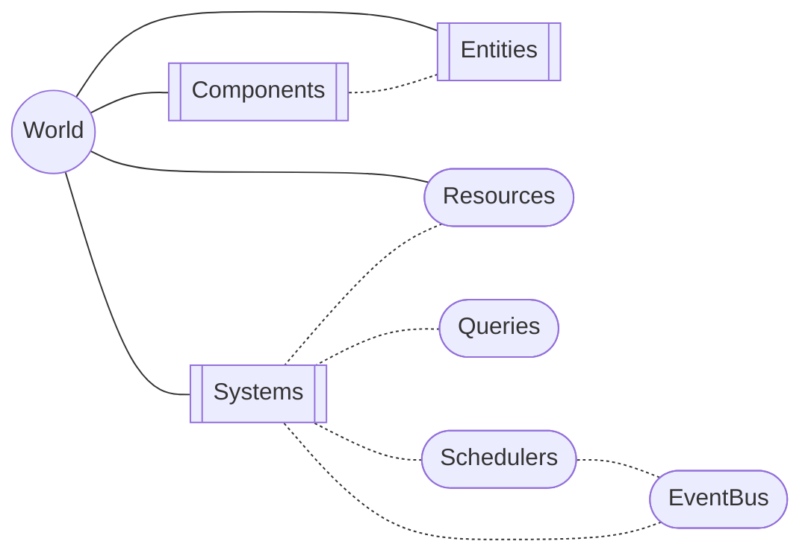
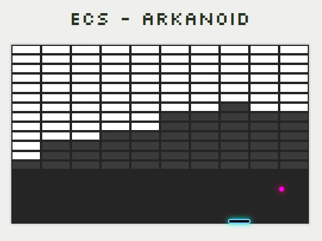
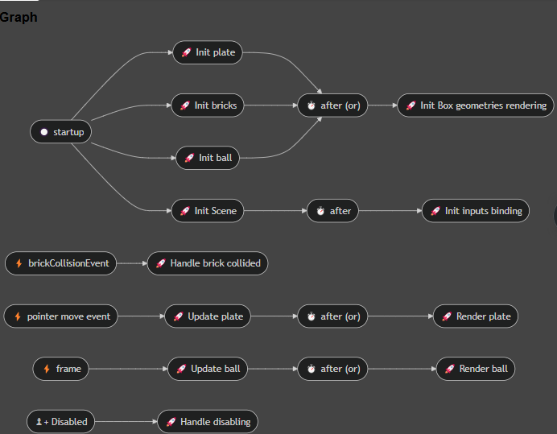

# ECS

(From Wikipedia) Entity–component–system (ECS) is a software architectural pattern mostly used in video game development for the representation of game world objects. An ECS comprises entities composed from components of data, with systems which operate on the components.

> **Warning:** This library is still under heavy development.

## What this ECS implementation is designed for :
  - Modularisation
  - Entities querying on a large amount of data (byteECS is doing a very nice job on this but doesn't have required feature + component values cannot be strings)
  - Components value indexing (WIP)
  - Advanced systems scheduling

## What this ECS implementation is NOT designed for :
The architecture of this project has been built as a requirement for the BIM project at "Etat de Genève". This means some features are required, others are nice to have, and some
are unwanted, because readability may be more important than performances in some cases and vice versa.

**Example :**
Systems parallelization

> Generally speaking, systems runtime is not critical for the project this ECS implementation has been written for. However, some
> optimizations in the implementation are highly possible seamlessly without being counter-productive toward the original purposes.

## Structure overview

ECS implements a world, hosting Entities, Components and systems.  
Entities are fetched from world with queries.  
Additional features such as `Resources`, `Scheduler`, `EventBus` adds convenient mechanisms to interact with the world (according to dedicated finality)



**Show me the code :**

> `//TODO: show entities/components`

```typescript
import { EcsWorld } from './world'
import { defineSystem } from './systems/define-system'
import { startup, timer } from './scheduling'
import { after } from './scheduling/after'
import type { EcsEvent } from './event-bus'
import { on } from './scheduling/on'
import { EcsResource } from './resources'

/** world instance */
const world = new EcsWorld({ verbose: true })

/** Counter state resource */
class CounterResource extends EcsResource {
  constructor(public value = 0) {
    super()
  }
}

// Event handling
const clickEvent = Symbol('clickEvent') as EcsEvent<{ boost: 20 }>
document.addEventListener('click', () => world.bus.publish(clickEvent, { boost: 20 }))

// Systems
const initSystem = defineSystem(
  'init',
  ({ container }) => {
    console.log('Hello init')
    container.register(new CounterResource(5))
  },
  startup, // At startup
)

const initSystem2 = defineSystem(
  'init 2',
  () => {
    console.log('Hello init 2')
  },
  after(initSystem), // After init system has finished (supports async predecessor)
)

const pollSystem = defineSystem(
  'polling',
  ({ container }) => {
    console.log('I am polling, counter value is: ', container.resolve(CounterResource).value++)
  },
  timer(1000), // Each second
)

const handleClickSystem = defineSystem(
  'handle click',
  ({ container }, { payload }) => {
    console.log(
      'boost counter',
      payload,
      (container.resolve(CounterResource).value += payload.boost),
    )
  },
  on(clickEvent), // On browser page click
)

// Registration
world
  .registerSystem(initSystem)
  .registerSystem(pollSystem)
  .registerSystem(initSystem2)
  .registerSystem(handleClickSystem)

// World activation
world.run()
```

## Démo projects
A démo project is part of this monorepo (many others to come hopefully :-).  
Checkout the ["ECS- Arkanoid" source code](./demo/arkanoid/src) to see ECS library in action:

  

Systems structure (cf. tooling) :  


**Run the project on local machine :**  
From the root folder,
* `npm install`
* `npm run demo:arkanoid` 

## Tooling

A (for now) very pragmatic Chromium extension has been created within this project to help debugging ECS projets.
For now, it only represents the systems structure of the ECS world as a graph:


## World

ECS root instance.  
Every instance within an `EcsWorld` has its life cycle tied to it.  
The whole API is also available from this root.

## Entities

Entities are actually indexes from which components are linked. `EntityPool` world instance is used to handle life cycle

### Creating a new entity

This creates 2 entities within the world

```typescript
import { EcsWorld } from './ecs-world'
import { EcsComponent } from './component'

class PersonComponent extends EcsComponent {}
class AnimalComponent extends EcsComponent {}
class NameComponent extends EcsComponent<string> {}

const world = new EcsWorld()
world.entities.spawn(new PersonComponent(), new NameComponent('Bob'))
world.entities.spawn(new AnimalComponent(), new NameComponent('Foxy'))
```

### Removing a new entity

This creates 2 entities within the world and removes foxy

```typescript
import { EcsWorld } from './ecs-world'
import { EcsComponent } from './component'

class PersonComponent extends EcsComponent {}
class AnimalComponent extends EcsComponent {}
class NameComponent extends EcsComponent<string> {}

const world = new EcsWorld()
world.entities.spawn(new PersonComponent(), new NameComponent('Bob'))
const foxyEntity = world.entities.spawn(new AnimalComponent(), new NameComponent('Foxy'))

// Microtask delay here

world.entities.remove(foxy)
```

### Changing entity links

This transforms foxy into a person

```typescript
import { EcsWorld } from './ecs-world'
import { EcsComponent } from './component'

class PersonComponent extends EcsComponent {}
class AnimalComponent extends EcsComponent {}
class NameComponent extends EcsComponent<string> {}

const world = new EcsWorld()
world.entities.spawn(new PersonComponent(), new NameComponent('Bob'))
const foxyEntity = world.entities.spawn(new AnimalComponent(), new NameComponent('Foxy'))

// Microtask delay here

world.entities.removeComponentFromEntity(foxyEntity, AnimalComponent)
world.entities.addComponentToEntity(
  foxyEntity,
  new PersonComponent() /* Instance could also have been eventually reused*/,
)
```

## Components

// TODO finalize implementation

ECS components inherit `EcsComponent<TValue>` class or derived. There are basically 3 kind of base classes provided by the library:
* `EcsComponent<TValue>` (with `TValue = void` by default) stands for an immutable component
* `EcsMutableComponent<TValue>` (with mandatory `TValue`) stands for a component with a mutable value. This mutation can be used to schedule systems handling this mutation for instance (WIP)
* `EcsIndexedComponent<TValue>` (with mandatory `TValue`) stands for a component with an immutable value which can be used in queries (WIP)

> Important current limitation: The current ECS implementation can handle a limited combinations of archetypes.
> Combinations are using bits masking through `UInt32Array`. The size of these arrays are fix for now and may be dynamic in the future.
> Queries performance is directly impacted by the size of this array. For now, default size is pretty bix (about 16 / 32 combinations).  
> A config parameter should at least be exposed in world construction.  
> To be finalized...

## Querying

### Basics of querying

```typescript
import { EcsWorld } from './ecs-world'
import { EcsComponent } from './component'
import { defineQuery } from './define-query'

const world = new EcsWorld()

// Components
class PersonComponent extends EcsComponent {}
class AnnimalComponent extends EcsComponent {}
class NameComponent extends EcsComponent<string> {}

// Entities
world.entities.spawn(new PersonComponent(), new NameComponent('Bob'))
world.entities.spawn(new AnnimalComponent(), new NameComponent('Foxy'))

// New query usage target
world.query.execute(() => [Component1, Component2])
world.query.execute(({without}) => [Component1, without(Component2)])
world.query.execute(({withValue}) => [Component1, withValue(Component2, 'foo')])
```

### Query processing details

Queries and entities are preprocessed and categorized by archetype to maximize execution and reduce redundant operations.

## Systems

### Scheduling

Handles systems scheduling.

Scheduling extends [`Scheduler`](./scheduler.ts). It is used by system runner to trigger systems at predefined time.  
At its core, it uses [AsyncIterator](https://developer.mozilla.org/en-US/docs/Web/JavaScript/Reference/Global_Objects/AsyncIterator)
to create "ticks" on which associated systems are triggered.

#### Existing schedulers

##### startup

This is the most basic scheduler, triggering once when the world is started.

```typescript
import { defineSystem } from './define-system'
import { startup } from './startup'

defineSystem(
  'foo',
  () => {
    // implementation here
  },
  startup, // Triggers the system only once at world startup
)
```

##### timer

This scheduler is triggering a Date.Now() each specified interval. Interval is specified as a parameter.

```typescript
import { defineSystem } from './define-system'
import { timer } from './timer'

defineSystem(
  'foo',
  () => {
    // implementation here
  },
  timer(500), // Triggers the system every 500ms
)
```

##### frame

This scheduler triggers each frame

```typescript
import { defineSystem } from './define-system'
import { frame } from './frame'

defineSystem(
  'foo',
  () => {
    // implementation here
  },
  frame, // Triggers the system every frame
)
```

##### on

This scheduler when the specified event is fired within the world event bus

```typescript
import { defineSystem } from './define-system'
import { on } from './on'
import { EcsEvent } from './ecs-event'

const FOO_EVENT = Symbol('foo event') as EcsEvent<number>

defineSystem(
  'foo',
  (_, { payload }) => {
    // payload is the event args (of type number in this case) the event has been fired with
    // implementation here
  },
  on(FOO_EVENT), // Triggers the system whenever the event is fired from world event bus
)
```

##### after

This scheduler is triggered whenever specified system has finished processing

```typescript
import { defineSystem } from './define-system'
import { after } from './after'

const system1 = defineSystem(/* System parameters here */)
defineSystem(
  'foo',
  () => {
    // implementation here
  },
  after(system1), // Triggers the system each time the system1 has finished being processed
)
```

Multiple systems can be specified. A combination option can be set (default value is `or`)

```typescript
import { defineSystem } from './define-system'
import { after } from './after'

defineSystem(
  'foo',
  () => {
    // implementation here
  },
  after([system1, system2], {
    combination: 'and', // Triggers the system each time the system1 AND system2 have been BOTH processed
  }),
)
```

#### Scheduler modifiers

##### compose

Scheduler can be aggregated this way:

```typescript
import { compose } from './compose'

compose(scheduler1, scheduler2) // Creates a scheduler combining scheduler1 and scheduler2 ticks
```

##### debounce

Scheduler can be debounced this way:

```typescript
import { debounce } from './debounce'

debounce(scheduler1, 10) // Resulting scheduler won't tick until scheduler1 separates its own ticks with at least 10ms
```

##### when

Scheduler can be filtered this way:

```typescript
import { when } from './when'

debounce((world) => {
  // Prepare here (container resolution for instance)
  return () => computePredicate() // Process filter here
}, scheduler1) // Resulting scheduler won't tick if predicate result is falsy
```

## Resources

Handles world resources definition and injection.  
The ResourceContainer class provides a mechanism for resolving and managing instances of resources.  
It supports both lazy creation of resources and registration of pre-existing resource instances.

### Basic usage

```typescript
import { EcsResource } from './ecs-resource'

const resourceContainer = new ResourceContainer()

class MyResource extends EcsResourceResource {}

const myResourceInstance = resourceContainer.resolve(MyResource) // Creates and returns a new instance of MyResource
const sameResourceInstance = resourceContainer.resolve(MyResource) // Returns the existing instance of MyResource
```

##3 Resources Factory

An `EcsResourceFactory<TResource>` is also provided to handle special cases such has nested dependency injection.  
For instance, let's consider `FooResource`, a class in which I want `BarResource` being injected. I can leverage `EcsResourceFactory`

```typescript
class FooResource {
  constructor(private readonly barResource: BarResource) {}
}
```

## EventBus

Handles pub/sub mechanism within a world instance.

The `EventBus` class provides a simple event management system for subscribing to and publishing events. It supports type-safe
event keys and allows handlers to be subscribed and unsubscribed dynamically.

By using `EcsEvent` symbols and generic types,
it ensures that events are handled in a type-safe manner.  
The `subscribe` method allows handlers to be added and returns a dispose
function for easy un-subscription, while the publish method notifies all subscribed handlers with the event data.

### Basic usage:

```typescript
// Define some event keys
import { EcsEvent } from './ecs-event'

const eventA = Symbol('eventA') as EcsEvent<string>
const eventB = Symbol('eventB') as EcsEvent<number>

// Create an event bus instance
const eventBus = new EventBus()

// Subscribe to events
const unsubscribeA = eventBus.subscribe(eventA, (value: string) => {
  console.log('Event A received:', value)
})
const unsubscribeB = eventBus.subscribe(eventB, (value: number) => {
  console.log('Event B received:', value)
})

// Publish events
eventBus.publish(eventA, 'Hello, Event A!')
eventBus.publish(eventB, 42)

// Unsubscribe from events
unsubscribeA()
unsubscribeB()

// Publish events again to see if handlers are removed
eventBus.publish(eventA, 'Hello again, Event A!')
eventBus.publish(eventB, 84)
```

## Plugins

Plugins can be used to package features connected to `EcsWorld`:

```typescript
import { EcsPlugin } from './ecs-plugin'

const FooPlugin: EcsPlugin = (world) => {
  // Systems registration
  world.registerSystem(foo1System)
  world.registerSystem(foo2System)

  // Queries registration
  world.query.register(fooQuery)

  // Resources declaration
  world.container.register(FooResource, new FooResource('foo'))

  // Event handling, ect...
}
```

Registered on to world instance this way:

```typescript
import { EcsWorld } from './ecs-world'
import { FooPlugin } from './foo-plugin'

/** Ecs world instance */
const world = new EcsWorld()

// Plugin registration
world.use(FooPlugin)
```


## How to contribute

If your project match our needs, you may be interested in some additional features or improvements. As such, contribution is very welcome.  
If this library is currently used for "État de Genève" BIM project, there are still things to maturate, nice features to add, tools to enhance and issues to find.

In any case, feel free to create an issue or a pull request if you have any feedback or suggestion about the current implementation.  
It definitely helps and these will be considered with care !